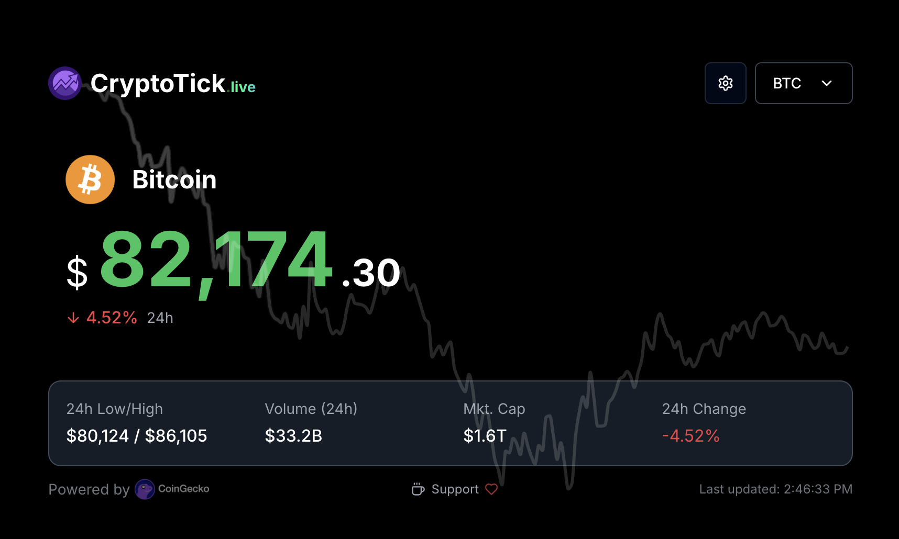

# CryptoTick.live - Real-time Cryptocurrency Price Tracker

A modern, real-time cryptocurrency price tracking application built with Next.js, featuring a beautiful UI and professional presentation mode for streaming and broadcasting.



## Features

- **Real-time Price Updates**: Live cryptocurrency price tracking with smooth transitions
- **Presentation Mode**: Full-screen display optimized for streaming and broadcasting
- **Audio Feedback**: Price change alerts with customizable sound effects
- **Dark/Light Mode**: Automatic theme switching based on system preferences
- **Mobile Responsive**: Optimized for all screen sizes
- **Multiple Cryptocurrencies**: Support for over 1000+ cryptocurrencies
- **Favorites**: Save your preferred cryptocurrencies for quick access
- **Price Charts**: Interactive price charts with 24-hour history
- **Google Analytics**: Built-in analytics with privacy-first approach
- **PWA Support**: Install as a standalone application

## Getting Started

### Prerequisites

- Node.js 18.0 or later
- npm or yarn
- Git

### Installation

1. Clone the repository:
```bash
git clone https://github.com/JoeanSteinbock/crypto-price-tracker.git
cd crypto-price-tracker
```

2. Install dependencies:
```bash
npm install
# or
yarn install
```

3. Create a `.env.local` file in the root directory and add your configuration:
```env
# Google Analytics ID (optional)
NEXT_PUBLIC_GA_ID="your-ga-id"

# Donation addresses (optional)
NEXT_PUBLIC_DONATION_BTC_TAPROOT="your-btc-address"
NEXT_PUBLIC_DONATION_ETH="your-eth-address"
# ... add other cryptocurrency addresses as needed
```

4. Start the development server:
```bash
npm run dev
# or
yarn dev
```

5. Open [http://localhost:3000](http://localhost:3000) in your browser.

### Building for Production

```bash
npm run build
npm start
# or
yarn build
yarn start
```

## Usage

### Basic Navigation

- Visit the homepage to see popular cryptocurrencies
- Click on any cryptocurrency to view detailed price information
- Use the search bar to find specific cryptocurrencies
- Toggle dark/light mode using the theme switcher
- Add cryptocurrencies to favorites for quick access

### Presentation Mode

1. Navigate to any cryptocurrency page
2. Click the "Presentation Mode" button
3. The interface will switch to a clean, full-screen display
4. Press ESC or click anywhere to exit presentation mode

### Streaming Setup

1. Capture the browser window in your streaming software (OBS, Streamlabs, etc.)
2. Enable presentation mode for a clean interface
3. Adjust the window size to match your streaming resolution
4. Optional: Enable audio alerts for price changes

## Contributing

Contributions are welcome! Please feel free to submit a Pull Request.

## License

This project is licensed under the MIT License - see the [LICENSE](LICENSE) file for details.

## Support

If you find this project useful, consider supporting its development:

- Bitcoin (Taproot): `bc1pd3xneatx2wglt8j92g747wpjyvjyga6j4ljyycc0mc2uxuddfzes8ald73`
- Ethereum: `0xc96d85fa4adb61331f50a2045d0a35d78060ed91`
- Solana: `22YZJuq1ZoBWDqN2Xn7Eqn7qspf46X7TmxSFEHEmp1eU`

## Acknowledgments

- Built with [Next.js](https://nextjs.org/)
- UI components from [shadcn/ui](https://ui.shadcn.com/)
- Price data from [CoinGecko API](https://www.coingecko.com/en/api)
- Icons from [Lucide](https://lucide.dev/) 